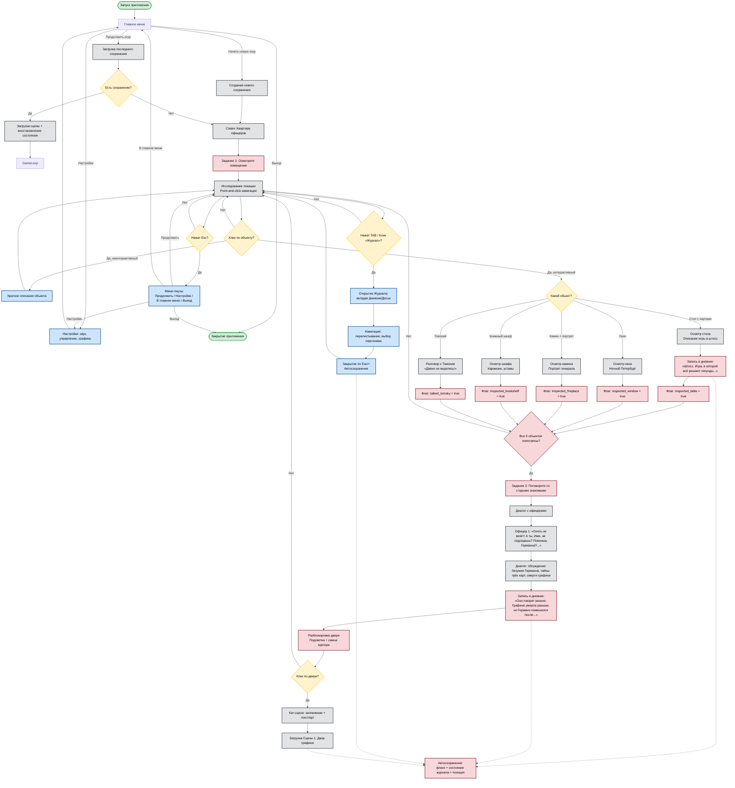

# User Stories

## Игрок (пользователь)

- Я, как игрок, хочу перемещаться между сценами, чтобы последовательно изучать сюжет.
- Я, как игрок, хочу нажимать E при наведении на объекты, чтобы получать информацию об объектах и персонажах.
- Я, как игрок, хочу нажимать E при приближении к NPC, чтобы запускать диалог.
- Я, как игрок, хочу видеть текстовые подсказки, чтобы понимать, что происходит в игре.
- Я, как игрок, хочу запускать сюжетные сцены, чтобы наблюдать реконструкцию событий.
- Я, как игрок, хочу получать доступ к новым сценам после выполнения условий, чтобы продвигаться дальше по сюжету.

## Разработчик

- Я, как разработчик, хочу добавлять новые сцены, чтобы расширять проект.
- Я, как разработчик, хочу настраивать интерактивные объекты, чтобы управлять логикой взаимодействия.
- Я, как разработчик, хочу редактировать текстовые элементы, чтобы корректировать сюжет и диалоги.
- Я, как разработчик, хочу управлять переходами между сценами, чтобы контролировать логику игры.

## Тестировщик
- Я, как тестировщик, хочу проверять работу интерактивных объектов, чтобы при клике отображалась правильная информация.
- Я, как тестировщик, хочу проверять запуск сюжетных сцен, чтобы они активировались при выполнении условий.
- Я, как тестировщик, хочу проверять отображение текстов, чтобы избежать ошибок и некорректного форматирования.
- Я, как тестировщик, хочу проверять поведение игры при разных действиях пользователя, чтобы выявить возможные баги.

#User Flow

