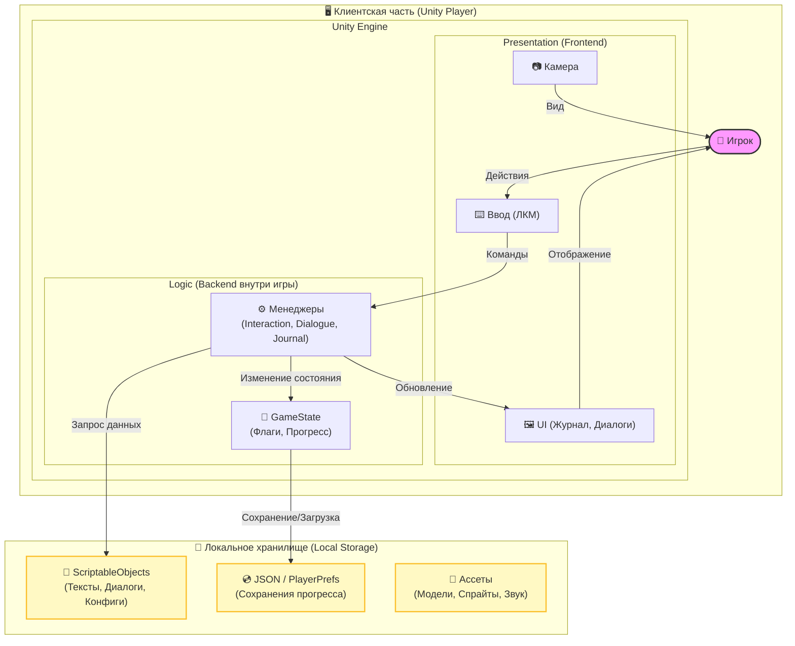

```mermaid
graph TD
    %% Стили
    classDef user fill:#f9f,stroke:#333,stroke-width:2px;
    classDef unity fill:#000,stroke:#fff,stroke-width:2px,color:#fff;
    classDef logic fill:#e1f5fe,stroke:#0277bd,stroke-width:2px;
    classDef data fill:#fff9c4,stroke:#fbc02d,stroke-width:2px;

    subgraph "🖥️ Клиентская часть (Unity Player)"
        direction TB
        
        User(["👤 Игрок"]):::user
        
        subgraph "Unity Engine"
            direction LR
            
            subgraph "Presentation (Frontend)"
                Input["⌨️ Ввод (ЛКМ)"]
                Camera["📷 Камера"]
                UI["🖼️ UI (Журнал, Диалоги)"]
            end

            subgraph "Logic (Backend внутри игры)"
                Manager["⚙️ Менеджеры<br/>(Interaction, Dialogue, Journal)"]
                State["🧠 GameState<br/>(Флаги, Прогресс)"]
            end
        end
    end

    subgraph "💾 Локальное хранилище (Local Storage)"
        direction TB
        SO["📜 ScriptableObjects<br/>(Тексты, Диалоги, Конфиги)"]:::data
        SaveFile["💿 JSON / PlayerPrefs<br/>(Сохранения прогресса)"]:::data
        Assets["🎨 Ассеты<br/>(Модели, Спрайты, Звук)"]:::data
    end

    %% Связи
    User -->|Действия| Input
    Input -->|Команды| Manager
    Manager -->|Запрос данных| SO
    Manager -->|Обновление| UI
    Manager -->|Изменение состояния| State
    State -->|Сохранение/Загрузка| SaveFile
    
    UI -->|Отображение| User
    Camera -->|Вид| User
```
